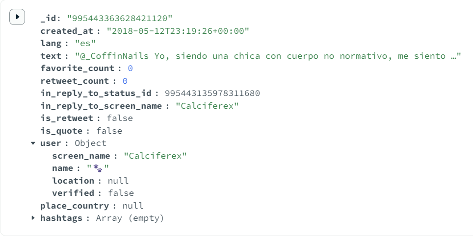

# Backend Setup Guide for CS498 Final Project

Author: [@YiChong_Liu](https://github.com/YiChong-Liu)

This guide walks you through how to set up and test the backend server for our CS498 final project using Node.js, Express, and MongoDB Atlas.

------

## Project Structure

```
cs498_final/
└── backend/
    ├── server.js
    ├── db.js
    ├── .env
    ├── .gitignore
    └── routes/
        └── api.js
```

------

## Step-by-Step Setup

### 1. Clone the Repo

```bash
git clone https://github.com/YiChong-Liu/cs498_final.git
cd cs498_final/backend
```

### 2. Install Dependencies

```bash
npm install express mongodb dotenv cors
```

### 3. Create a `.env` File

Add your MongoDB URI in `backend/.env`:

```
MONGODB_URI=mongodb+srv://<username>:<password>@cluster0.mongodb.net/cs498_final?retryWrites=true&w=majority
```

Replace `<username>` and `<password>` with your actual MongoDB Atlas credentials.

### 4. Ignore the .env File (important!)

In `backend/.gitignore`, add:

```
.env
```

### 5. Start the Server

```bash
node server.js
```

You should see something like:

```
Server running on http://localhost:5000
```

------

## API Endpoints

### 1. Test Connection

**URL:** `http://localhost:5000/api/test`

**Expected Response:**

```json
{
  "status": "ok",
  "db": "connected",
  "collections": ["tweets"]
}
```

------

### 2. Thread by User

**URL Format:**

```
http://localhost:5000/api/thread-by-user?screen_name=<username>
```

**Example:**



```
http://localhost:5000/api/thread-by-user?screen_name=Calciferex
```

**What it does:** Returns all reply tweets by the given user, ordered by time.

Make sure to use a name that actually has replies (e.g., Calciferex).


### 3. Most Active Country

**URL:**

```
http://localhost:5000/api/most-active-country
```

**What it does:** Returns the country with the highest number of tweets, based on the `place_country` field in the dataset (could be null).


### 4. Most Active User

**URL:**

```
http://localhost:5000/api/most-active-user
```

**What it does:** Returns the user who has posted the most tweets in total.


###  5. Top Hashtags

**URL:**

```
http://localhost:5000/api/top-hashtags
```

**What it does:** Returns the most frequently used hashtags across all tweets. If a tweet includes multiple hashtags, each one is counted. By default, returns the top 100.


**Update:** the limit can now be manually set as well. for example:

```
http://localhost:5000/api/top-hashtags?limit=3
```

It will now display the top 3 hashtags.


### 6. Three User Cycles

**URL:**

```
http://localhost:5000/api/three-user-cycles
```

**What it does:** Finds groups of three users (A, B, C) such that:

- A replied to B and B replied to A
- A replied to C and C replied to A
- B replied to C and C replied to B

### 7. Verified User Engagement

**URL:**

```
http://localhost:5000/api/verified-user-engagement
```

**What it does:** For each verified user, calculates the percentage of their tweets that are:

- Original tweets
- Replies
- Retweets